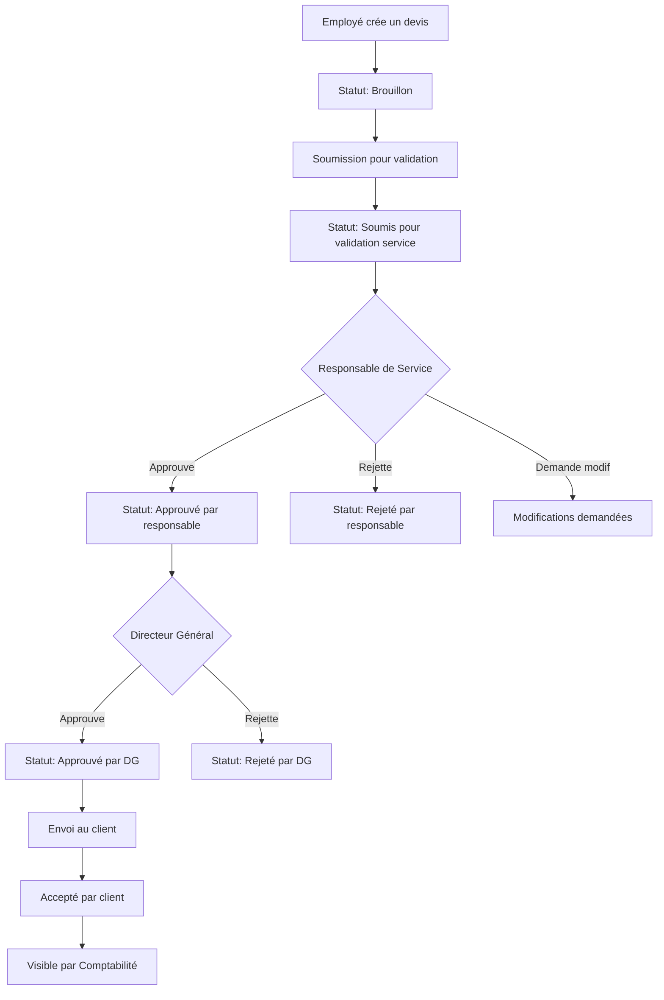

# Logiciel de Facturation Parabellum Groups

Un logiciel de facturation moderne et complet développé avec React, Node.js, Express et SQLite, conçu pour les entreprises multi-services avec workflow de validation hiérarchique.

## 🚀 Fonctionnalités Principales

### ✅ Implémentées
- **Authentification sécurisée** avec JWT et gestion des rôles
- **Tableau de bord adaptatif** selon le rôle et le service
- **Architecture multi-services** (Commercial, Progitek, RH, Comptabilité, Direction)
- **Gestion des utilisateurs** avec 5 niveaux de permissions
- **Interface moderne** avec design responsive
- **API RESTful** complète et documentée

### 🔄 En développement
- **Gestion des clients** avec association aux services
- **Workflow de validation des devis** (Employé → Responsable → DG)
- **Facturation automatisée** avec conversion des devis
- **Modules comptables étendus** (écritures, bilan, trésorerie)
- **Gestion des dépenses et fournisseurs**
- **Système de paie des employés**

## 🏗️ Architecture Technique

### Backend
- **Node.js** avec Express.js
- **TypeScript** pour la sécurité des types
- **Prisma ORM** avec SQLite
- **JWT** pour l'authentification
- **Zod** pour la validation des données
- **Winston** pour les logs

### Frontend
- **React 18** avec TypeScript
- **Tailwind CSS** pour le design
- **React Query** pour la gestion d'état serveur
- **React Hook Form** pour les formulaires
- **Recharts** pour les graphiques
- **React Router** pour la navigation

## 🎯 Rôles et Permissions

### 👑 Directeur Général
- Accès complet à toutes les fonctionnalités
- Validation finale des devis
- Vue consolidée de tous les services

### 🔧 Administrateur
- Gestion complète du système
- Configuration des paramètres
- Gestion des utilisateurs

### 👔 Responsable de Service
- Gestion de son service spécifique
- Validation des devis de son équipe
- Dashboard de performance du service

### 💼 Employé
- Création de devis et factures
- Gestion des clients de son service
- Dashboard personnel

### 📊 Comptable
- Accès aux factures validées
- Gestion des paiements
- Modules comptables et trésorerie

## 🚀 Installation et Démarrage

### Prérequis
- Node.js 18+ 
- npm ou yarn

### Backend
```bash
cd backend
npm install
cp .env.example .env
# Configurer les variables d'environnement dans .env
npx prisma generate
npx prisma migrate dev
npm run seed
npm run dev
```

### Frontend
```bash
cd frontend
npm install
npm run dev
```

## 🔐 Comptes de Démonstration

| Rôle | Email | Mot de passe |
|------|-------|--------------|
| Directeur Général | dg@parabellum.com | password123 |
| Administrateur | admin@parabellum.com | password123 |
| Resp. Commercial | resp.commercial@parabellum.com | password123 |
| Commercial | commercial@parabellum.com | password123 |
| Comptable | comptable@parabellum.com | password123 |

## 📊 Workflow de Validation des Devis



## 🗄️ Structure de la Base de Données

### Tables Principales
- **services** - Services de l'entreprise
- **users** - Utilisateurs avec rôles et services
- **customers** - Clients associés aux services
- **products** - Catalogue produits/services
- **quotes** - Devis avec workflow de validation
- **invoices** - Factures avec suivi des paiements
- **payments** - Paiements et allocations

### Tables Étendues
- **employees** - Gestion des employés
- **salaries** - Historique des paies
- **expenses** - Dépenses de l'entreprise
- **suppliers** - Fournisseurs
- **accounting_entries** - Écritures comptables
- **cash_flow** - Mouvements de trésorerie

## 🔧 API Endpoints

### Authentification
- `POST /api/v1/auth/login` - Connexion
- `POST /api/v1/auth/refresh` - Renouvellement token
- `GET /api/v1/auth/profile` - Profil utilisateur

### Dashboard
- `GET /api/v1/dashboard` - Dashboard principal
- `GET /api/v1/dashboard/service/:id` - Dashboard service
- `GET /api/v1/dashboard/employee/:id` - Dashboard employé

### À venir
- Gestion des clients, produits, devis, factures
- Modules comptables et de paie
- Rapports et analyses

## 🎨 Design System

### Couleurs
- **Primaire**: #1976D2 (Bleu professionnel)
- **Succès**: #10B981 (Vert validation)
- **Attention**: #F59E0B (Orange)
- **Erreur**: #EF4444 (Rouge)

### Composants
- Interface responsive avec Tailwind CSS
- Composants réutilisables et accessibles
- Animations subtiles et micro-interactions
- Design cohérent sur tous les écrans

## 📈 Roadmap

### Phase 1 - ✅ Terminée
- Architecture de base
- Authentification et rôles
- Dashboard adaptatif

### Phase 2 - 🔄 En cours
- Gestion des clients
- Workflow des devis
- Facturation de base

### Phase 3 - 📋 Planifiée
- Modules comptables
- Gestion des dépenses
- Système de paie

### Phase 4 - 🔮 Future
- Rapports avancés
- API publique
- Applications mobiles

## 🤝 Contribution

Ce projet suit les meilleures pratiques de développement :
- Code TypeScript strict
- Tests automatisés
- Documentation complète
- Architecture modulaire

## 📄 Licence

Propriété de Parabellum Groups - Tous droits réservés.

---

**Développé avec ❤️ par l'équipe Parabellum Groups**