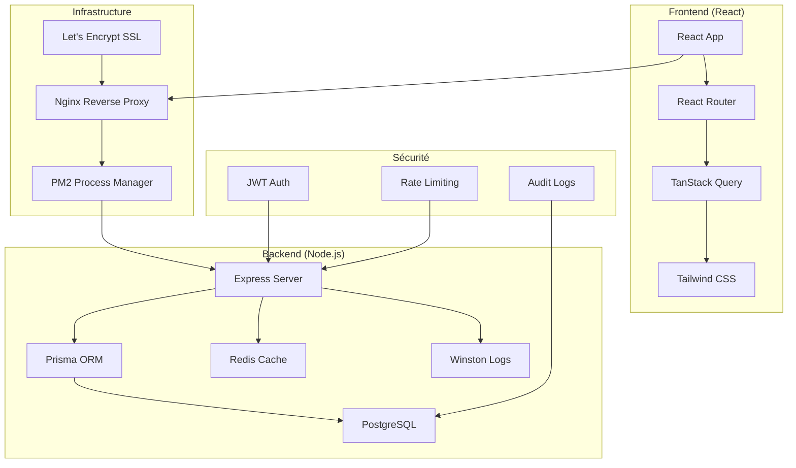
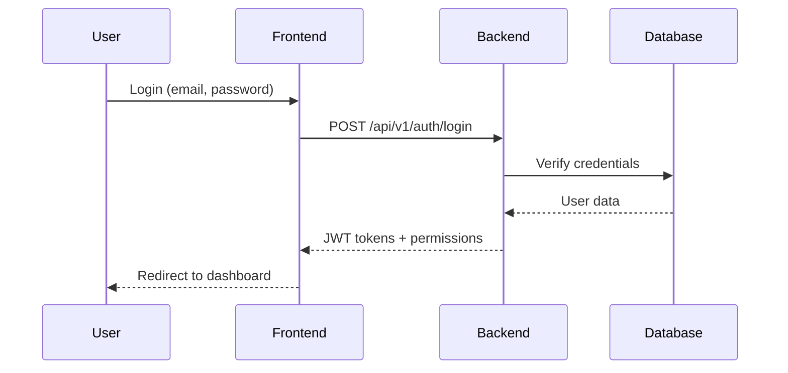
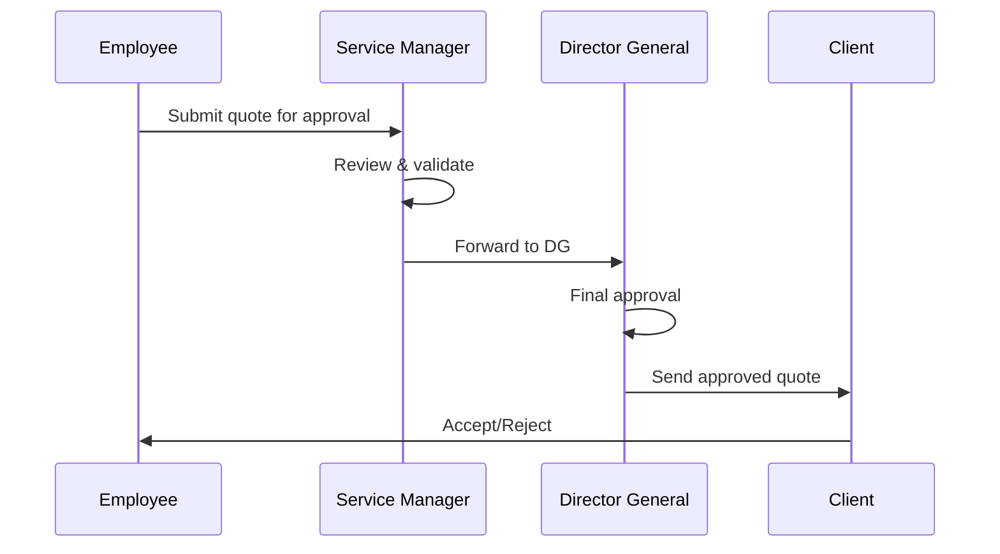

# 🏗️ ARCHITECTURE TECHNIQUE - PARABELLUM GROUPS

## 📐 Vue d'Ensemble



## 🎯 Principes Architecturaux

### 1. Séparation des Responsabilités
- **Frontend** : Interface utilisateur et logique de présentation
- **Backend** : Logique métier et accès aux données
- **Base de données** : Persistance et intégrité des données

### 2. Architecture en Couches

#### Frontend (3 couches)
```
┌─────────────────────────────────────┐
│           Présentation              │
│  (Pages, Composants, Modales)       │
├─────────────────────────────────────┤
│            Services                 │
│   (API calls, State Management)     │
├─────────────────────────────────────┤
│            Utilitaires              │
│  (Helpers, Formatters, Validators)  │
└─────────────────────────────────────┘
```

#### Backend (4 couches)
```
┌─────────────────────────────────────┐
│            Routes                   │
│    (Endpoints, Middlewares)         │
├─────────────────────────────────────┤
│          Contrôleurs                │
│      (Logique métier)               │
├─────────────────────────────────────┤
│           Services                  │
│   (Business Logic, Validations)     │
├─────────────────────────────────────┤
│        Accès aux Données            │
│     (Prisma ORM, Cache)             │
└─────────────────────────────────────┘
```

## 🔐 Sécurité Multi-Niveaux

### 1. Authentification
```typescript
// JWT avec double token
interface AuthTokens {
  accessToken: string;   // 1h - opérations courantes
  refreshToken: string;  // 7d - renouvellement
}
```

### 2. Autorisation Granulaire
```typescript
// Permissions par ressource.action
const permissions = [
  'customers.create',
  'quotes.approve_dg',
  'reports.financial'
];
```

### 3. Validation Multi-Niveaux
- **Frontend** : Zod schemas + React Hook Form
- **Backend** : Express Validator + Prisma constraints
- **Base de données** : Contraintes PostgreSQL

## 📊 Gestion des Données

### 1. Modèle de Données
```sql
-- Relations principales
User 1:N Service
Customer N:1 Service
Quote N:1 Customer
Invoice N:1 Quote (optionnel)
Payment N:M Invoice (allocations)
```

### 2. Cache Strategy
```typescript
// Cache Redis avec TTL
const CACHE_STRATEGY = {
  USER_PROFILE: 1800,      // 30 min
  DASHBOARD_STATS: 300,    // 5 min
  CUSTOMER_LIST: 600,      // 10 min
  REPORTS: 3600           // 1 heure
};
```

### 3. Audit Trail
```typescript
// Traçabilité complète
interface AuditLog {
  userId: number;
  action: string;
  resource: string;
  details: object;
  timestamp: Date;
}
```

## 🔄 Flux de Données

### 1. Flux d'Authentification


### 2. Flux de Création de Devis


## 🚀 Performance et Scalabilité

### 1. Optimisations Frontend
- **Code Splitting** : Lazy loading des routes
- **Memoization** : React.memo pour composants
- **Virtual Scrolling** : Listes importantes
- **Image Optimization** : WebP + lazy loading

### 2. Optimisations Backend
- **Connection Pooling** : PostgreSQL
- **Query Optimization** : Index + EXPLAIN ANALYZE
- **Caching** : Redis pour données fréquentes
- **Compression** : Gzip responses

### 3. Monitoring Performance
```typescript
// Métriques clés
const PERFORMANCE_METRICS = {
  API_RESPONSE_TIME: '<200ms',
  DATABASE_QUERY_TIME: '<100ms',
  CACHE_HIT_RATIO: '>80%',
  ERROR_RATE: '<1%'
};
```

## 🔧 Configuration par Environnement

### Development
```typescript
const devConfig = {
  database: 'localhost:5432',
  redis: 'localhost:6379',
  logging: 'debug',
  cors: ['http://localhost:5173'],
  rateLimit: false
};
```

### Production
```typescript
const prodConfig = {
  database: 'production-db:5432',
  redis: 'production-redis:6379',
  logging: 'info',
  cors: ['https://app.parabellum.com'],
  rateLimit: true,
  ssl: true,
  clustering: true
};
```

## 📱 Responsive Design

### Breakpoints Tailwind
```css
/* Mobile First */
sm: 640px   /* Tablettes */
md: 768px   /* Tablettes large */
lg: 1024px  /* Desktop */
xl: 1280px  /* Desktop large */
2xl: 1536px /* Desktop XL */
```

### Composants Adaptatifs
- **Navigation** : Sidebar → Bottom nav (mobile)
- **Tableaux** : Scroll horizontal + cartes (mobile)
- **Modales** : Fullscreen (mobile)
- **Graphiques** : Responsive containers

## 🔄 CI/CD Pipeline

### 1. Workflow GitHub Actions
```yaml
name: Deploy Parabellum
on:
  push:
    branches: [main]

jobs:
  test:
    runs-on: ubuntu-latest
    steps:
      - uses: actions/checkout@v3
      - name: Setup Node.js
        uses: actions/setup-node@v3
        with:
          node-version: '18'
      - name: Install dependencies
        run: npm ci
      - name: Run tests
        run: npm test
      - name: Build
        run: npm run build

  deploy:
    needs: test
    runs-on: ubuntu-latest
    steps:
      - name: Deploy to VPS
        run: |
          ssh user@vps "cd /var/www/parabellum-groups && ./deploy.sh"
```

### 2. Stratégie de Déploiement
- **Blue-Green** : Déploiement sans interruption
- **Rolling Updates** : Mise à jour progressive
- **Rollback** : Retour version précédente

## 📊 Métriques et KPIs

### 1. Métriques Techniques
- **Uptime** : >99.9%
- **Response Time** : <200ms (P95)
- **Error Rate** : <0.1%
- **Throughput** : 1000 req/min

### 2. Métriques Métier
- **Utilisateurs actifs** : Connexions quotidiennes
- **Transactions** : Devis/Factures créés
- **Conversion** : Prospects → Clients
- **Satisfaction** : Temps de réponse utilisateur

## 🔮 Évolutions Futures

### 1. Microservices
```
┌─────────────────┐  ┌─────────────────┐  ┌─────────────────┐
│   Auth Service  │  │ Business Service │  │ Report Service  │
│                 │  │                 │  │                 │
│ - JWT           │  │ - Customers     │  │ - Analytics     │
│ - Permissions   │  │ - Quotes        │  │ - Exports       │
│ - Audit         │  │ - Invoices      │  │ - Dashboards    │
└─────────────────┘  └─────────────────┘  └─────────────────┘
```

### 2. Technologies Émergentes
- **GraphQL** : API plus flexible
- **WebSockets** : Temps réel
- **PWA** : Application mobile
- **AI/ML** : Prédictions et recommandations

### 3. Intégrations
- **ERP** : SAP, Odoo
- **Comptabilité** : Sage, Ciel
- **Paiement** : Stripe, PayPal
- **Communication** : Slack, Teams

---

**Architecte** : Équipe Parabellum Groups  
**Version** : 1.0.0  
**Date** : Janvier 2025