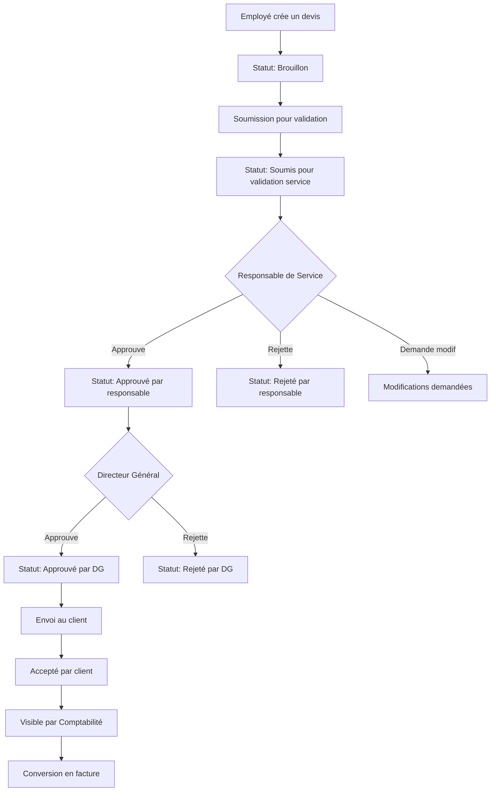

# Fiche Technique - Logiciel de Facturation Parabellum Groups

## 📋 Informations Générales

| Propriété | Valeur |
|-----------|--------|
| **Nom du projet** | Logiciel de Facturation Parabellum Groups |
| **Version** | 1.0.0 |
| **Type** | Application web de gestion commerciale |
| **Statut** | En développement actif |
| **Licence** | Propriétaire - Parabellum Groups |
| **Date de création** | Janvier 2024 |
| **Dernière mise à jour** | Juillet 2024 |

## 🏗️ Architecture Technique

### Stack Technologique

#### Frontend
- **Framework** : React 18.3.1 avec TypeScript
- **Build Tool** : Vite 5.4.2
- **Routing** : React Router DOM 6.20.1
- **State Management** : React Query 3.39.3 + Context API
- **UI Framework** : Tailwind CSS 3.4.1
- **Forms** : React Hook Form 7.48.2
- **Icons** : Lucide React 0.344.0
- **Charts** : Recharts 2.8.0
- **Notifications** : React Hot Toast 2.4.1
- **HTTP Client** : Axios 1.6.2
- **Date Handling** : Date-fns 2.30.0

#### Backend
- **Runtime** : Node.js 18+
- **Framework** : Express.js 4.18.2
- **Language** : TypeScript 5.3.3
- **ORM** : Prisma 5.7.1
- **Database** : SQLite (production-ready)
- **Authentication** : JWT (jsonwebtoken 9.0.2)
- **Security** : bcryptjs 2.4.3, helmet 7.1.0, cors 2.8.5
- **Validation** : Zod 3.22.4
- **Email** : Nodemailer 6.9.7
- **PDF Generation** : PDFKit 0.14.0
- **Logging** : Winston 3.11.0
- **Rate Limiting** : express-rate-limit 7.1.5

### Architecture Système

```
┌─────────────────────────────────────────────────────────┐
│                    Frontend (React)                     │
│  ┌─────────────┐ ┌─────────────┐ ┌─────────────────┐   │
│  │  Dashboard  │ │   Clients   │ │   Facturation   │   │
│  └─────────────┘ └─────────────┘ └─────────────────┘   │
│  ┌─────────────┐ ┌─────────────┐ ┌─────────────────┐   │
│  │  Employés   │ │  Comptabilité│ │   Paramètres   │   │
│  └─────────────┘ └─────────────┘ └─────────────────┘   │
└─────────────────────────────────────────────────────────┘
                            │ HTTP/REST API
                            ▼
┌─────────────────────────────────────────────────────────┐
│                   Backend (Express.js)                 │
│  ┌─────────────┐ ┌─────────────┐ ┌─────────────────┐   │
│  │    Auth     │ │   Business  │ │   Controllers   │   │
│  │ Middleware  │ │    Logic    │ │                 │   │
│  └─────────────┘ └─────────────┘ └─────────────────┘   │
│  ┌─────────────┐ ┌─────────────┐ ┌─────────────────┐   │
│  │ Validation  │ │   Services  │ │   Middleware    │   │
│  └─────────────┘ └─────────────┘ └─────────────────┘   │
└─────────────────────────────────────────────────────────┘
                            │ Prisma ORM
                            ▼
┌─────────────────────────────────────────────────────────┐
│                   Database (SQLite)                    │
│  ┌─────────────┐ ┌─────────────┐ ┌─────────────────┐   │
│  │   Users &   │ │  Customers  │ │   Invoicing     │   │
│  │  Services   │ │ & Products  │ │  & Payments     │   │
│  └─────────────┘ └─────────────┘ └─────────────────┘   │
│  ┌─────────────┐ ┌─────────────┐ ┌─────────────────┐   │
│  │  Employees  │ │  Expenses   │ │   Accounting    │   │
│  │ & Payroll   │ │ & Suppliers │ │   & Audit       │   │
│  └─────────────┘ └─────────────┘ └─────────────────┘   │
└─────────────────────────────────────────────────────────┘
```

## 🎯 Fonctionnalités Implémentées

### ✅ Modules Opérationnels

#### 1. Authentification et Sécurité
- **JWT Authentication** avec refresh tokens
- **Gestion des rôles** : 5 niveaux (Admin, DG, Responsable, Employé, Comptable)
- **Permissions granulaires** par service et hiérarchie
- **Sécurité renforcée** : bcrypt, rate limiting, CORS, helmet

#### 2. Gestion Multi-Services
- **5 Services** : Direction, Commercial, Progitek, RH, Comptabilité
- **Isolation des données** par service
- **Dashboards adaptés** selon le rôle et le service
- **Workflow hiérarchique** pour la validation des devis

#### 3. Gestion des Clients
- **CRUD complet** avec validation avancée
- **Adresses multiples** (facturation, livraison)
- **Catégorisation** et segmentation
- **Association aux services** pour un suivi ciblé
- **Historique des interactions** complet

#### 4. Catalogue Produits/Services
- **Gestion complète** des produits et services
- **Tarification flexible** avec remises
- **Gestion des stocks** pour les produits physiques
- **Catégorisation** et recherche avancée

#### 5. Workflow de Devis Avancé
- **Création intuitive** avec sélection produits
- **Validation hiérarchique** : Employé → Responsable → DG
- **Statuts détaillés** avec traçabilité complète
- **Notifications automatiques** à chaque étape
- **Conversion automatique** en factures

#### 6. Facturation Professionnelle
- **Génération automatique** depuis les devis
- **Numérotation séquentielle** conforme
- **Calculs automatiques** HT/TVA/TTC
- **Gestion des échéances** et relances
- **Statuts de paiement** détaillés

#### 7. Suivi des Paiements
- **Enregistrement multi-factures** avec allocations
- **Modes de paiement** variés
- **Rapprochement automatique** avec les factures
- **Gestion des impayés** et créances

#### 8. Gestion des Employés (Nouveau)
- **Fiches employés complètes** avec contrats
- **Gestion de la paie** avec calculs automatiques
- **Suivi des congés** avec workflow d'approbation
- **Historique complet** des salaires et absences

#### 9. Gestion des Dépenses
- **Enregistrement des dépenses** par catégorie
- **Gestion des fournisseurs** avec coordonnées bancaires
- **Justificatifs numériques** et suivi des paiements
- **Rapports de dépenses** par période

#### 10. Comptabilité Intégrée
- **Dashboard comptable** avec indicateurs clés
- **Suivi de trésorerie** en temps réel
- **Créances et dettes** avec échéanciers
- **Prévisions financières** automatiques

## 🗄️ Modèle de Données

### Tables Principales (20 tables)

#### Gestion des Utilisateurs et Services
- `services` - Services de l'entreprise
- `users` - Utilisateurs avec rôles et services
- `audit_logs` - Traçabilité des actions
- `settings` - Configuration système

#### Gestion Commerciale
- `customers` - Clients avec association aux services
- `customer_addresses` - Adresses multiples des clients
- `products` - Catalogue produits/services
- `product_prices` - Tarification multiple

#### Workflow de Facturation
- `quotes` - Devis avec workflow de validation
- `quote_items` - Lignes de devis
- `quote_approvals` - Historique des validations
- `invoices` - Factures avec statuts
- `invoice_items` - Lignes de factures
- `payments` - Paiements clients
- `payment_allocations` - Affectation des paiements

#### Gestion des Employés
- `employees` - Fiches employés complètes
- `salaries` - Historique des paies
- `leaves` - Gestion des congés (à implémenter)

#### Gestion des Dépenses
- `expenses` - Dépenses de l'entreprise
- `suppliers` - Fournisseurs

#### Comptabilité
- `accounting_entries` - Écritures comptables
- `cash_flow` - Mouvements de trésorerie

### Relations Clés
- **Hiérarchie des services** : Users → Services → Customers
- **Workflow de validation** : Quotes → Quote_Approvals → Users
- **Facturation complète** : Quotes → Invoices → Payments → Allocations
- **Gestion RH** : Employees → Salaries + Leaves

## 🔐 Sécurité et Permissions

### Système de Rôles (5 niveaux)

#### 👑 Directeur Général
- **Accès complet** à toutes les fonctionnalités
- **Validation finale** des devis
- **Vue consolidée** de tous les services
- **Gestion des utilisateurs** et paramètres

#### 🔧 Administrateur
- **Gestion système** complète
- **Configuration** des paramètres
- **Gestion des utilisateurs** et services
- **Accès aux logs** d'audit

#### 👔 Responsable de Service
- **Gestion de son service** spécifique
- **Validation des devis** de son équipe
- **Dashboard de performance** du service
- **Gestion des employés** de son service

#### 💼 Employé
- **Création de devis** et factures
- **Gestion des clients** de son service
- **Dashboard personnel** avec ses indicateurs
- **Soumission pour validation** hiérarchique

#### 📊 Comptable
- **Accès aux factures** validées
- **Gestion des paiements** et créances
- **Modules comptables** et trésorerie
- **Rapports financiers** détaillés

### Sécurité Technique
- **JWT avec expiration** (1h + refresh 7j)
- **Hachage bcrypt** des mots de passe
- **Rate limiting** par IP et utilisateur
- **Validation Zod** de toutes les entrées
- **CORS configuré** et headers sécurisés
- **Logs d'audit** complets

## 📊 Workflow de Validation des Devis



## 🚀 Performance et Optimisation

### Frontend
- **Code splitting** avec lazy loading
- **React Query** pour la mise en cache
- **Memoization** des composants coûteux
- **Optimisation des re-renders**
- **Bundle size** optimisé

### Backend
- **Index de base de données** sur les colonnes critiques
- **Pagination** efficace avec curseurs
- **Cache des requêtes** fréquentes
- **Compression gzip** des réponses
- **Pool de connexions** optimisé

### Base de Données
- **SQLite optimisé** avec WAL mode
- **Index composites** pour les requêtes complexes
- **Triggers** pour les calculs automatiques
- **Vues matérialisées** pour les rapports

## 📁 Structure du Projet

```
facturation-parabellum/
├── frontend/                   # Application React
│   ├── src/
│   │   ├── components/        # Composants réutilisables
│   │   │   ├── common/       # Composants génériques
│   │   │   ├── customers/    # Gestion clients
│   │   │   ├── quotes/       # Gestion devis
│   │   │   ├── invoices/     # Gestion factures
│   │   │   ├── employees/    # Gestion employés
│   │   │   ├── expenses/     # Gestion dépenses
│   │   │   ├── suppliers/    # Gestion fournisseurs
│   │   │   ├── payments/     # Gestion paiements
│   │   │   ├── accounting/   # Comptabilité
│   │   │   └── settings/     # Paramètres
│   │   ├── pages/            # Pages principales
│   │   ├── hooks/            # Hooks personnalisés
│   │   ├── services/         # Services API
│   │   ├── types/            # Types TypeScript
│   │   ├── utils/            # Utilitaires
│   │   └── styles/           # Styles globaux
│   ├── public/               # Assets statiques
│   └── package.json
├── backend/                   # API Express
│   ├── src/
│   │   ├── controllers/      # Contrôleurs API
│   │   ├── routes/           # Routes Express
│   │   ├── middleware/       # Middlewares
│   │   ├── models/           # Modèles Prisma
│   │   ├── services/         # Services métier
│   │   ├── config/           # Configuration
│   │   ├── validations/      # Schémas de validation
│   │   └── utils/            # Utilitaires
│   ├── prisma/               # Schéma et migrations
│   │   ├── schema.prisma     # Modèle de données
│   │   ├── seed.ts           # Données de test
│   │   └── migrations/       # Migrations DB
│   ├── logs/                 # Logs applicatifs
│   └── package.json
├── docs/                     # Documentation
│   ├── ArchitectureTechnique.md
│   ├── SpécificationsFonctionnelles.md
│   ├── ModélisationBaseDeDonnées.md
│   ├── SpécificationsTechniques.md
│   └── FicheTechnique.md
└── README.md                 # Documentation principale
```

## 🎨 Design System

### Palette de Couleurs
- **Primaire** : #1976D2 (Bleu professionnel)
- **Succès** : #10B981 (Vert validation)
- **Attention** : #F59E0B (Orange)
- **Erreur** : #EF4444 (Rouge)
- **Neutre** : Gamme de gris pour les textes

### Composants UI
- **Boutons** : 4 variantes (primary, secondary, success, danger)
- **Formulaires** : Validation en temps réel
- **Tableaux** : Tri, filtrage, pagination
- **Modales** : Confirmations et formulaires
- **Notifications** : Toast avec 4 types
- **Graphiques** : Recharts pour les analytics

### Responsive Design
- **Mobile First** : Optimisé pour tous les écrans
- **Breakpoints** : 768px (tablet), 1024px (desktop)
- **Navigation adaptative** : Sidebar/bottom tabs
- **Touch-friendly** : Boutons et interactions tactiles

## 🔄 Workflow Métier

### Processus de Facturation
1. **Création client** → Association au service
2. **Création devis** → Validation hiérarchique
3. **Approbation** → Responsable puis DG
4. **Envoi client** → Acceptation
5. **Conversion facture** → Envoi automatique
6. **Suivi paiement** → Relances automatiques

### Gestion des Employés
1. **Création fiche** → Informations complètes
2. **Gestion contrat** → CDI/CDD/Stage/Freelance
3. **Calcul paie** → Automatique avec cotisations
4. **Gestion congés** → Workflow d'approbation

### Comptabilité
1. **Écritures automatiques** → Depuis factures/paiements
2. **Suivi trésorerie** → Temps réel
3. **Rapports financiers** → Génération automatique
4. **Conformité** → Respect des normes françaises

## 📈 Métriques et KPIs

### Indicateurs Techniques
- **Temps de réponse** : < 2s pour les opérations courantes
- **Disponibilité** : 99.5% visé
- **Sécurité** : 0 vulnérabilité critique
- **Performance** : Score Lighthouse > 90

### Indicateurs Métier
- **Utilisateurs actifs** : Suivi par service
- **Devis créés** : Par employé et service
- **Taux de validation** : Responsables et DG
- **Chiffre d'affaires** : Par service et global
- **Délais de paiement** : Moyens par client

## 🛠️ Outils de Développement

### Frontend
- **ESLint** : Linting du code TypeScript/React
- **Prettier** : Formatage automatique
- **Vite** : Build tool rapide avec HMR
- **TypeScript** : Typage statique strict

### Backend
- **TSX** : Exécution TypeScript en développement
- **Prisma Studio** : Interface graphique de la DB
- **Winston** : Logging structuré
- **Jest** : Tests unitaires (à implémenter)

### Base de Données
- **Prisma Migrate** : Gestion des migrations
- **Prisma Generate** : Génération des types
- **SQLite Browser** : Inspection de la DB

## 🔧 Configuration et Déploiement

### Variables d'Environnement

#### Backend (.env)
```bash
# Base de données
DATABASE_URL="file:./database.sqlite"

# JWT
JWT_SECRET="votre-secret-jwt-super-securise"
JWT_EXPIRES_IN="1h"
JWT_REFRESH_EXPIRES_IN="7d"

# Serveur
PORT=3001
NODE_ENV="development"

# Email
SMTP_HOST="smtp.gmail.com"
SMTP_PORT=587
SMTP_USER="votre-email@gmail.com"
SMTP_PASS="votre-mot-de-passe-app"

# Entreprise
COMPANY_NAME="Parabellum Groups"
COMPANY_EMAIL="contact@parabellum.com"
COMPANY_PHONE="+33 1 23 45 67 89"
```

#### Frontend (.env)
```bash
VITE_API_URL="http://localhost:3001/api/v1"
VITE_APP_NAME="Parabellum Facturation"
```

### Scripts de Démarrage

#### Backend
```bash
npm run dev      # Développement avec hot-reload
npm run build    # Build production
npm run start    # Démarrage production
npm run migrate  # Migrations DB
npm run seed     # Données de test
```

#### Frontend
```bash
npm run dev      # Serveur de développement
npm run build    # Build production
npm run preview  # Aperçu du build
npm run lint     # Vérification du code
```

## 📊 Comptes de Démonstration

| Rôle | Email | Mot de passe | Service |
|------|-------|--------------|---------|
| **Directeur Général** | dg@parabellum.com | password123 | Direction |
| **Administrateur** | admin@parabellum.com | password123 | Direction |
| **Resp. Commercial** | resp.commercial@parabellum.com | password123 | Commercial |
| **Commercial** | commercial@parabellum.com | password123 | Commercial |
| **Resp. Progitek** | resp.progitek@parabellum.com | password123 | Progitek |
| **Développeur** | dev@parabellum.com | password123 | Progitek |
| **Comptable** | comptable@parabellum.com | password123 | Comptabilité |

## 🔮 Roadmap Technique

### Phase Actuelle (v1.0) - ✅ Terminée
- Architecture de base complète
- Authentification et rôles
- Gestion clients et produits
- Workflow de devis complet
- Facturation de base
- Gestion des employés
- Dashboard adaptatif

### Phase 2 (v1.1) - 🔄 En cours
- Génération PDF des documents
- Envoi automatique d'emails
- Rapports avancés
- Import/Export de données
- API publique

### Phase 3 (v1.2) - 📋 Planifiée
- Facturation récurrente
- Comptabilité analytique
- Gestion des stocks avancée
- Application mobile
- Intégrations tierces

## 🧪 Tests et Qualité

### Tests Frontend
- **Tests unitaires** : Jest + React Testing Library
- **Tests d'intégration** : Cypress
- **Tests de performance** : Lighthouse CI
- **Couverture** : > 80% visée

### Tests Backend
- **Tests unitaires** : Jest
- **Tests d'intégration** : Supertest
- **Tests de charge** : Artillery
- **Couverture** : > 85% visée

### Qualité du Code
- **TypeScript strict** : Mode strict activé
- **ESLint** : Règles strictes
- **Prettier** : Formatage automatique
- **Husky** : Pre-commit hooks

## 📞 Support et Maintenance

### Monitoring
- **Logs structurés** avec Winston
- **Métriques de performance** en temps réel
- **Alertes automatiques** sur erreurs
- **Dashboard de monitoring** système

### Sauvegarde
- **Sauvegarde quotidienne** automatique
- **Rétention** : 30 jours
- **Test de restauration** mensuel
- **Sauvegarde cloud** sécurisée

### Mise à jour
- **Migrations automatiques** de la DB
- **Déploiement sans interruption**
- **Rollback automatique** en cas d'erreur
- **Tests de régression** automatisés

## 📋 Prérequis Système

### Développement
- **Node.js** : 18.0.0 ou supérieur
- **npm** : 8.0.0 ou supérieur
- **Git** : Pour le versioning
- **VS Code** : IDE recommandé avec extensions

### Production
- **Serveur** : Linux/Windows Server
- **RAM** : 2GB minimum, 4GB recommandé
- **Stockage** : 10GB minimum pour la DB et logs
- **Réseau** : HTTPS obligatoire

### Extensions VS Code Recommandées
- TypeScript and JavaScript Language Features
- Prisma
- Tailwind CSS IntelliSense
- ES7+ React/Redux/React-Native snippets
- Auto Rename Tag
- Bracket Pair Colorizer

---

**Développé avec ❤️ par l'équipe Parabellum Groups**

*Cette fiche technique est mise à jour régulièrement pour refléter l'évolution du projet.*